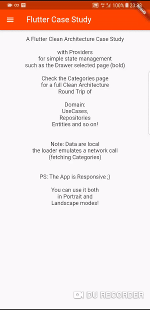

# flutter_case_study

A case study on Flutter using the CLEAN Architecture and Providers

A Provider is used to keep the state of the selected item in the Drawer

Categories follow the CLEAN Architecture round trip of Domain use cases, entities and data repositories

Added Categories + Products + Product Details UI :)

Have a look ;)

